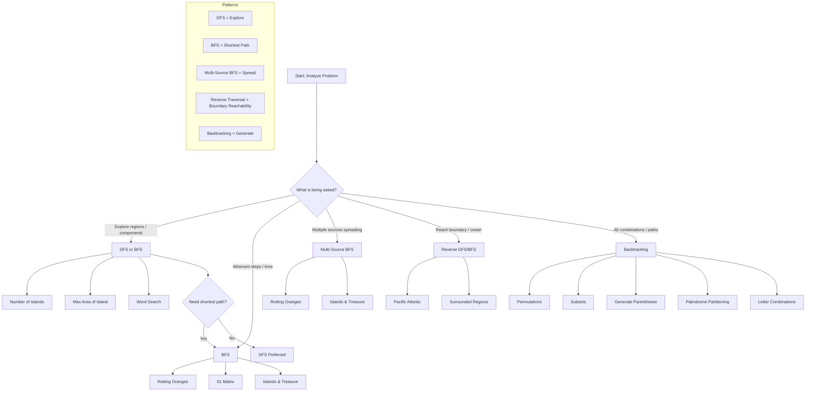

# 🧠 Problem Solving Patterns — DFS, BFS, Backtracking

---

## 🚀 1. High-Level Decision Tree

When you see a problem, start with this:

---

### 🔍 What is the problem asking?

---

#### 🟩 A. Explore regions / connected components

- Traverse the grid or graph
- Find clusters / components

👉 Use:
- DFS (preferred)
- BFS (also valid)

**Examples:**
- Number of Islands
- Max Area of Island
- Word Search

---

#### 🟦 B. Minimum steps / shortest time / nearest distance

👉 Use:
- BFS

**Why?**
- BFS explores level-by-level → guarantees shortest path in unweighted graphs

**Examples:**
- Rotting Oranges
- 01 Matrix
- Islands & Treasure

---

#### 🟥 C. Multiple sources spreading simultaneously

👉 Use:
- Multi-Source BFS

**Key Idea:**
- All sources start at the same time
- Spread happens in "waves"

**Examples:**
- Rotting Oranges
- Islands & Treasure

---

#### 🟪 D. Reach boundary / ocean / escape

👉 Use:
- Reverse DFS/BFS (start from boundary)

**Key Idea:**
- Instead of checking from every cell → start from destination

**Examples:**
- Pacific Atlantic Water Flow
- Surrounded Regions

---

#### 🟨 E. Generate all combinations / paths

👉 Use:
- Backtracking

**Examples:**
- Permutations
- Subsets
- Generate Parentheses
- Palindrome Partitioning
- Letter Combinations

---

## 🌳 2. Mermaid Decision Diagram

